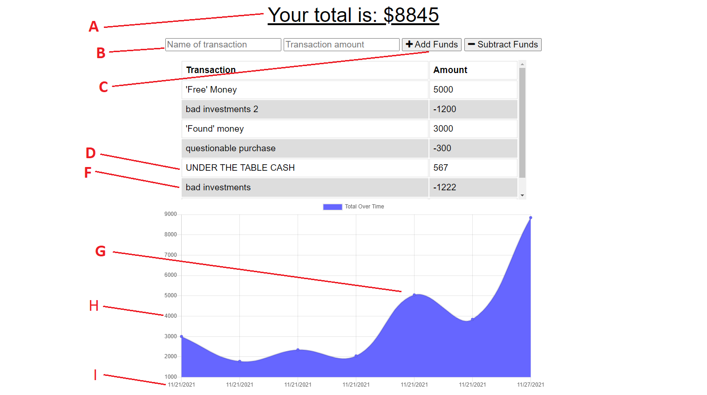

#  **MR Online-Offline Budget Tracker** 

    

### **Navigation**

[Description](#description) / [Screenshots](#screenshots) / [Questions](#questions)/ [Installation](#installation)

-------

## **Description** 
A client requested a realtime budgeting app that had offline input, online update capabilities. This app fulfills that requirement while also containing a host of dashboard features. 

---------

## **Screenshots:**

Menu in order

A. Rolling Total

B. Name and amount input field

C. Add or Subtract this amount

D. Rows are alternating colors 

F. Name and amount listed

G. Realtime Graph

H.Funds

I.Date

---------------

## **Questions:**

### **What licenses are needed?**
    "NPM"   
    "compression": "^1.7.4",
    "dotenv": "^10.0.0",
    "express": "^4.17.1",
    "lite-server": "^2.5.3",
    "mongoose": "^5.5.15",
    "morgan": "^1.9.1"

### **Installation**
npm -i

### **Testing** 
There are no tests

### **Will it be maintained?** 
it will not be maintained

### **Can I contribute?** 
You cannot contribute

